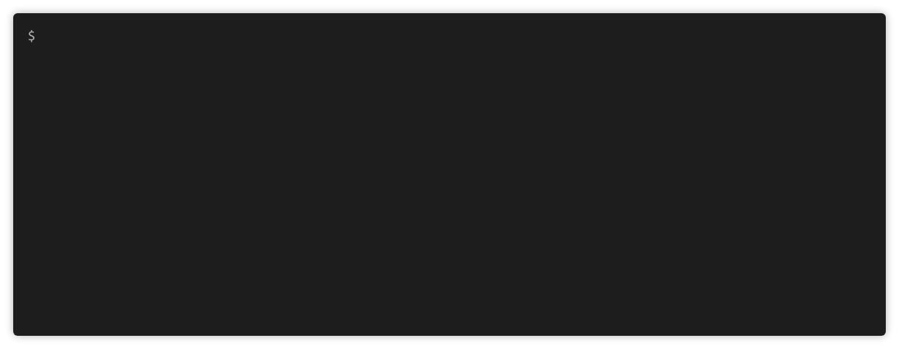

# AuthCov
[](https://badge.fury.io/js/authcov)

Web app authorization coverage scanning.



## Introduction

AuthCov crawls your web application using a Chrome headless browser while logged in as a pre-defined user. It intercepts and logs API requests as well as pages loaded during the crawling phase. In the next phase it logs in under a different user account, the "intruder", and attempts to access each of one of the API requests or pages discovered previously. It repeats this step for each intruder user defined. Finally it generates a detailed report listing the resources discovered and whether or not they are accessible to the intruder users.

An example report generated from scanning a local Wordpress instance:
[](https://authcov.github.io/example_report/index.html)

## Features
- Works with single-page-applications and traditional multi-page-applications
- Handles token-based and cookie-based authentication mechanisms
- Generates an in-depth report in HTML format
- Screenshots of each page crawled can be viewed in the report

## Installation

Install node 10. Then run:

```bash
$ npm install -g authcov
```

## Usage

1. Generate a config for the site you want to scan:
```bash
$ authcov new myconfig.js
```
2. Update the values in myconfig.js
3. Test your configuration values by running this command to ensure the browser is logging in successfully.
```
$ authcov test-login myconfig.js --headless=false
```
4. Crawl your site:
```bash
$ authcov crawl myconfig.js
```
5. Attempt intrusion against the resources discovered during the crawling phase:
```bash
$ authcov intrude myconfig.js
```
6. View the generated report at: `./tmp/report/index.html`

## Configuration

The following options can be set in your config file:
| option | type | description |
| --- | --- | --- |
| baseUrl | string | The base URL of the site. This is where the crawler will start from. |
| crawlUser | object | The user to crawl the site under. |
| intruders | array | The users who will intrude on the api endpoints and pages discovered during the crawling phase. Generally these will be users the same or less privilege than the crawlUser. To intrude as a not-logged-in user, add a user with the username "Public" and password null. |
| type | string | Is this a single-page-application (i.e. javascript frontend which queries an API backend) or a more "traditional" multi-page-application. (Choose "mpa" or "spa"). |
| authenticationType | string | Does the site authenticate users by using the cookies sent by the browser, or by a token sent in a request header? For an MPA this will almost always be set to "cookie". In an SPA this could be either "cookie" or "token". (Choose "cookie" or "token") |
| authorisationHeaders | array | Which request headers are needed to be sent in order to authenticate a user? If authenticationType=cookie, then this should be set to ["cookie"]. If authenticationType=token, then this will be something like: ["X-Auth-Token"]. |

## Contributing

**Unit Tests**

Unit tests:
```bash
$ npm test test/unit
```

**Integration tests:**

First download and run the [example app](https://github.com/evanrolfe/example_app). Then run the tests:
```bash
$ npm test test/integration
```
